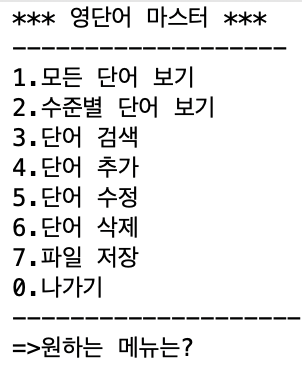
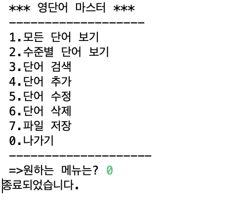

# Project1

## Java CRUD 구현 프로그램 - 영단어 메모장(Create,Read,Update,Delete)

* * *

## CRUD Interface

### 다음은 프로그램의 Interface 화면입니다.
* * *

### '0. 나가기' 선택 시 

## Create

### '4.단어 추가' 선택 시

## Read
* * *

### '1. 모든 단어 보기' 선택 시

* * *
### '2. 수준별 단어 보기' 선택 시

* * *
### '3. 단어 검색' 선택 시

## Update
* * *

### '5. 단어 수정' 선택 시

* * *

* * *

### '7. 파일 저장' 선택 시

* * *

* * *

## Delete
* * *

### '6. 단어 삭제' 선택 시
* * *

* * *

 

